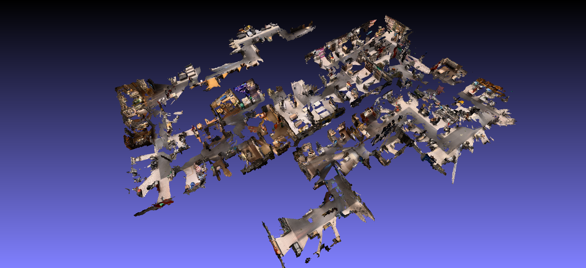

本文档主要说明将 lingbot-map 在 **16GB 内存加 8GB 显存** 上测试 **长序列** 的细节。

由于内存紧张，添加了 lazyloader 和 offline_rerun 选项，但是这让 demo.py 变得繁杂。所以把 demo.py 拆成了 predict_long.py 和 create_ply.py 两个文件，后续还会补充 create_rrd.py，以完善回放功能。

1. 获取预测结果 (demo.py中的predictions)

```bash
PYTORCH_CUDA_ALLOC_CONF=expandable_segments:True python predict_long.py --model_path ../models/lingbot-map-long.pt --image_folder PATH1 --max_height 294 --offload_to_cpu --num_scale_frames 2 --keyframe_interval 2 --kv_cache_sliding_window 48 --camera_num_iterations 1 --output_dir PATH2
```

2. 体素融合与创建ply文件

    *请先安装open3d*

```bash
python create_ply.py --pred_path PATH --conf_threshold 5 --voxel_size 0.006 --max_frames 5000 --batch_size 100
```

3. 预览ply文件

    *多种方式查看ply文件*

```bash
python open3d_.py FILE.ply
```

```bash
meshlab FILE.ply
```

4. indoor_travel 测试结果 (原始视频 500s 50fps 共 25000 帧 ，按 10fps 预处理后 5000 帧)

