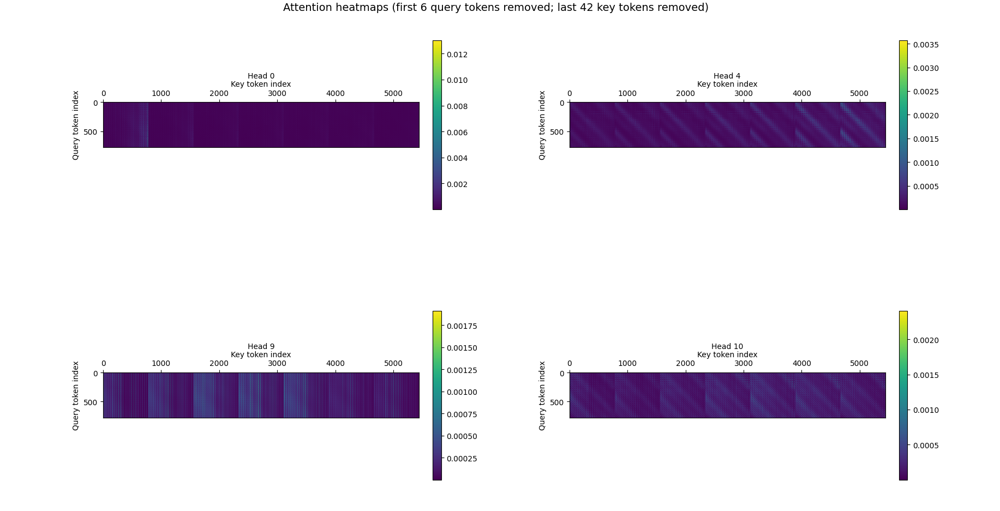
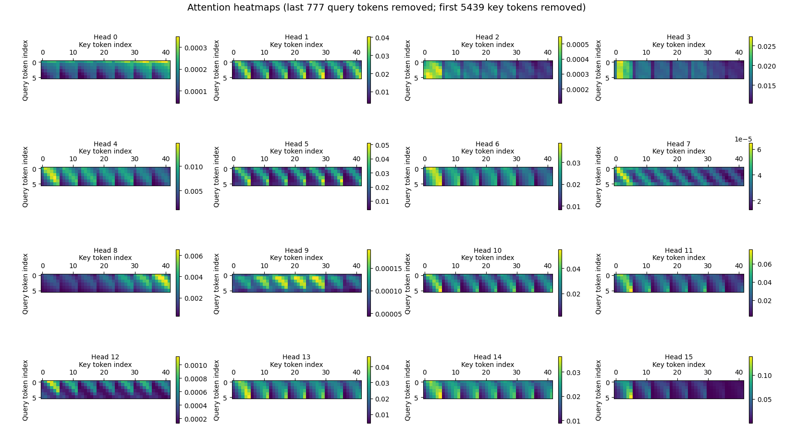

本文档主要说明将 lingbot-map 在 **16GB 内存加 8GB 显存** 上测试 **长序列**、跑通 **benchmark** 以及探索 **优化** 的细节。

由于内存紧张，添加了 lazyloader 和 offline_rerun 选项，但是这让 demo.py 变得繁杂。所以把 demo.py 拆成了 predict_long.py 和 create_ply.py 两个文件，后续还会补充 create_rrd.py，以完善回放功能。

1. 获取预测结果 (demo.py中的predictions)

```bash
PYTORCH_CUDA_ALLOC_CONF=expandable_segments:True python predict_long.py --model_path ../models/lingbot-map-long.pt --image_folder PATH1 --max_height 294 --offload_to_cpu --num_scale_frames 2 --keyframe_interval 2 --kv_cache_sliding_window 48 --camera_num_iterations 1 --output_dir PATH2
```

2. 体素融合与创建ply文件

    *请先安装open3d*

```bash
python create_ply.py --pred_path PATH --conf_threshold 5 --voxel_size 0.006 --max_frames 5000 --batch_size 100
```

3. 预览ply文件

    *多种方式查看ply文件*

```bash
python open3d_.py FILE.ply
```

```bash
meshlab FILE.ply
```

4. indoor_travel 测试结果 (原始视频 500s 50fps 共 25000 帧 ，按 10fps 预处理后 5000 帧)


5. benchmark oxford_spires keble-college-02

    *不要省略 PYTORCH_CUDA_ALLOC_CONF=expandable_segments:True ！*

```bash
python prepare.py --config configs/oxford.yaml
PYTORCH_CUDA_ALLOC_CONF=expandable_segments:True python run.py --config configs/oxford.yaml -f
python evaluate.py --config configs/oxford.yaml
python report.py --workspace ../../bench_output/oxford_spires/
```


6. streaming 模式跑 320 帧序列

    *默认 offload_to_cpu=True*

```bash
python scripts/predict_stream.py --model_path ../models/lingbot-map-long.pt --image_folder example/oxford --output_dir ./output/ --num_scale_frames 2 --kv_cache_sliding_window 48
```

7. 启用 **量化 --quant** 后可按默认 kv_cache_sliding_window=64 跑 320 帧序列

    *量化后推理速度降低一半，最终结果没有明显退化，且节省更多显存用于 kv cache*

```bash
python scripts/predict_stream.py --model_path ../models/lingbot-map-long.pt --image_folder example/oxford --output_dir ./output/ --num_scale_frames 2 --quant
```

8. 启用 **fp8量化 --quant_new** 相比 **--quant** 推理速度明显提升，权重显存略增

```bash
python scripts/predict_stream.py --model_path ../models/lingbot-map-long.pt --image_folder example/oxford --output_dir ./output/ --num_scale_frames 2 --quant_new
```

9. 详细对比 权重激活量化、KV Cache fp8 量化 和 KV Cache 下采样 对计算资源和运行结果的影响

    *显存峰值、FPS和序列无关，ATE、轨迹平滑程度按 oxford_spires keble-college-02 比较*

    *轨迹平滑程度由肉眼观察*

    *KV Cache 下采样受限于现有的 FlashInfer Page + evict frame/keep special 框架，目前只能对所有帧都做下采样，*

    *实际想要的做法是 scale frame 和 当前帧 不做下采样，滑窗里的帧才做下采样*

```bash
基准：
benchmark lingbot_map_stream.yaml
相当于：
python scripts/predict_stream.py --model_path ../models/lingbot-map-long.pt --image_folder example/oxford --output_dir ./output/ --first_k 320 --num_scale_frames 2 --kv_cache_sliding_window 48
```

| 摘要 | 权重激活量化 | KV Cache fp8 量化 | KV Cache 下采样 | 显存峰值(GB) | FPS | ATE | 轨迹平滑 |
|-------|-------|-------|-------|-------|-------|-------|-------|
| 基准 | 禁用 | 禁用 | 禁用 | <span style="color:Chocolate">7.13</span> | <span style="color:Chocolate">3.6</span> | 基准 | 基准 |
| 单项分析 | int4、int8混合 | - | - | 5.37 | 2.2 | 轻微变化 | 轻微变化 |
| 单项分析 | fp8 | - | - | 5.68 | 3.7 | 轻微变化 | <span style="color:orange">显著变差</span> |
| 单项分析 | - | 启用 | - | 5.17 | 3.3 | 轻微变化 | 轻微变化 |
| 单项分析 | - | - | 启用 | 4.4 | 5.4 | <span style="color:orange">显著变差</span> | 轻微变化 |
| 最小内存 | int4、int8混合 | 启用 | 启用 | <span style="color:green">**2.05**</span> | 2.7 | <span style="color:orange">显著变差</span> | 轻微变化 |
| 最快 | fp8 | - | 启用 | 2.96 | <span style="color:green">**5.8**</span> | <span style="color:brown">显著变差</span> | <span style="color:brown">显著变差</span> |
| 平衡 | int4、int8混合 | 启用 | - | 3.41 | <span style="color:orange">2.1</span> | <span style="color:green">轻微变化</span> | <span style="color:green">轻微变化</span> |

    除了 keble-college-02，还比较了 example 中的 oxford、unversity、loop 以及 indoor_travel 的重建结果，从重建结果反推发现 oxford 的轨迹有大的跳变异常，其他序列的结果是有变差但还不至于异常。

10. 尝试分析注意力矩阵

    *此部分仅为简单尝试，更加完备的分析可以参考 AVGGT、RetrieveVGGT 等论文*
    
    条件断点设在 FlashInferKVCacheManager：：compute_attention 的 self.prefill_wrapper.run 位置，条件为 block_idx == 23，在第 7 帧的时候开始后续操作。
    
    先按照 debug_console.py 中的的方法在调试断点生成并保存注意力矩阵，然后使用 attn_vis.py 生成可视化结果。

    由于混合了 patch tokens 和 special tokens，因此需要分开处理。

```bash
python scripts/helper/attn_vis.py output/attn_analysis/7th_frame_global_block_idx_23.pt --mode heatmap --head 0,4,9,10 --kv-sp 42 --q-sp 6 --cols 2
```



```bash
python scripts/helper/attn_vis.py output/attn_analysis/7th_frame_global_block_idx_23.pt --mode heatmap --head 0-15 --kv-patch 5439 --q-patch 777 --cols 4
```

