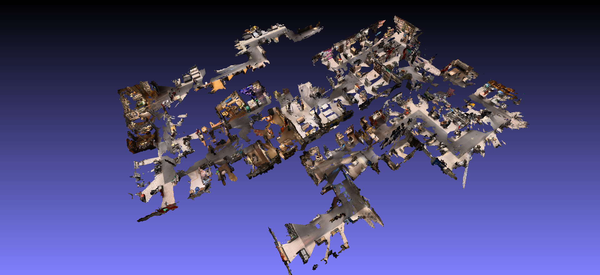
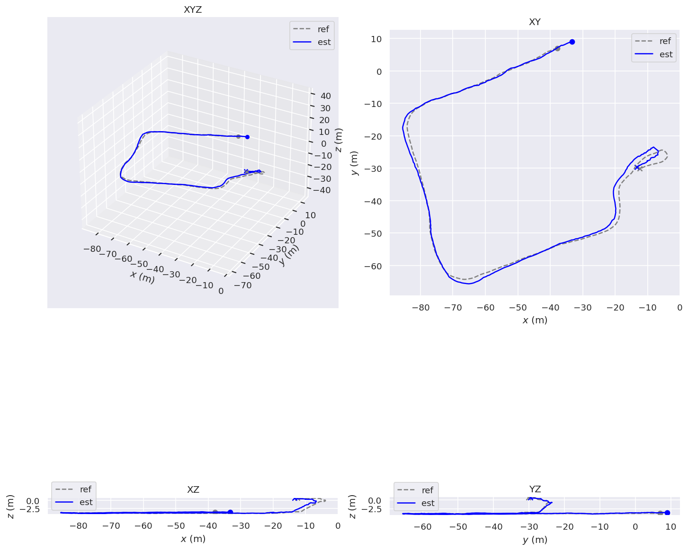
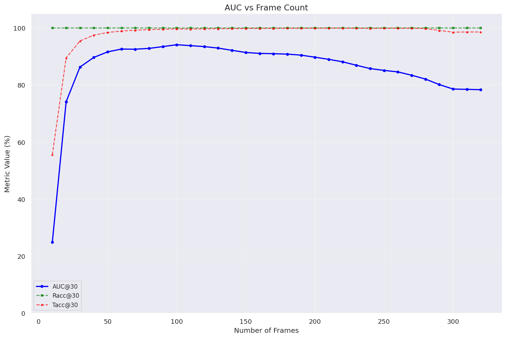

本文档主要说明将 lingbot-map 在 **16GB 内存加 8GB 显存** 上测试 **长序列**、跑通 **benchmark** 以及探索 **优化** 的细节。

由于内存紧张，添加了 lazyloader 和 offline_rerun 选项，但是这让 demo.py 变得繁杂。所以把 demo.py 拆成了 predict_long.py 和 create_ply.py 两个文件，后续还会补充 create_rrd.py，以完善回放功能。

1. 获取预测结果 (demo.py中的predictions)

```bash
PYTORCH_CUDA_ALLOC_CONF=expandable_segments:True python predict_long.py --model_path ../models/lingbot-map-long.pt --image_folder PATH1 --max_height 294 --offload_to_cpu --num_scale_frames 2 --keyframe_interval 2 --kv_cache_sliding_window 48 --camera_num_iterations 1 --output_dir PATH2
```

2. 体素融合与创建ply文件

    *请先安装open3d*

```bash
python create_ply.py --pred_path PATH --conf_threshold 5 --voxel_size 0.006 --max_frames 5000 --batch_size 100
```

3. 预览ply文件

    *多种方式查看ply文件*

```bash
python open3d_.py FILE.ply
```

```bash
meshlab FILE.ply
```

4. indoor_travel 测试结果 (原始视频 500s 50fps 共 25000 帧 ，按 10fps 预处理后 5000 帧)



5. benchmark oxford_spires keble-college-02

    *不要省略 PYTORCH_CUDA_ALLOC_CONF=expandable_segments:True ！*

```bash
python prepare.py --config configs/oxford.yaml
PYTORCH_CUDA_ALLOC_CONF=expandable_segments:True python run.py --config configs/oxford.yaml -f
python evaluate.py --config configs/oxford.yaml
python report.py --workspace ../../bench_output/oxford_spires/
```




6. streaming 模式跑 320 帧序列

    *默认 offload_to_cpu=True*

```bash
python scripts/predict_stream.py --model_path ../models/lingbot-map-long.pt --image_folder example/oxford --output_dir ./output/ --num_scale_frames 2 --kv_cache_sliding_window 48
```

7. 启用 **量化 --quant** 后可按默认 kv_cache_sliding_window=64 跑 320 帧序列

    *量化后推理速度降低一半，最终结果没有明显退化，且节省更多显存用于 kv cache*

```bash
python scripts/predict_stream.py --model_path ../models/lingbot-map-long.pt --image_folder example/oxford --output_dir ./output/ --num_scale_frames 2 --quant
```